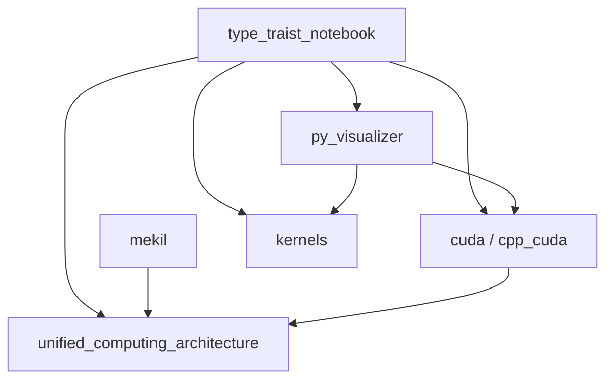

# infrastructure

底层计算基础设施仓库，聚合多个 git 子模块，通过 `build.py` 一键配置、编译、测试与安装。

Host 代码使用 **C++26**（CMake 3.30+、Clang 20）；`cuda` 子模块中设备代码为 CUDA C++20。详见 `scripts/cxx26.cmake`。

## 依赖仓库

### Git 子模块

| 子模块 | 路径 | 说明 |
|--------|------|------|
| type_traist_notebook | [type_traist_notebook/](type_traist_notebook/) | C++26 头文件库，底层类型与数值工具 |
| py_visualizer | [py_visualizer/](py_visualizer/) | Python 可视化与插件框架 |
| mekil | [mekil/](mekil/) | Intel oneMKL 封装（CPU 线性代数 / FFT） |
| cuda | [cuda/](cuda/) | CUDA 封装（CMake 包名 `cpp_cuda`） |
| kernels | [kernels/](kernels/) | 多项式、卷积核、正交基等 |
| unified_computing_architecture | [unified_computing_architecture/](unified_computing_architecture/) | 统一计算抽象层（uca） |

### 系统依赖

| 依赖 | 用途 |
|------|------|
| Clang 20、llvm-20-dev | 编译器 |
| CMake 3.30+ | 构建（`init-build-env.sh` 在 `.venv` 中安装；`build.py` 兜底） |
| python3-venv | 创建 `.venv` |
| Intel oneMKL | mekil；由 `scripts/init-build-env.sh` 配置 |
| Boost.Python、Python3 dev | py_visualizer |
| CUDA Toolkit | cuda 子模块 |
| FFTW（可选） | mekil 可选后端 |

## 依赖树

### 子模块编译依赖（`find_package`）

下图展示各子模块之间的编译依赖关系（箭头指向被依赖方）：



说明：

- `type_traist_notebook` 为底层头文件库，被 py_visualizer、cuda、kernels、uca 依赖
- `mekil` 与 `cuda` 互不依赖（cuda 还需 py_visualizer）
- `kernels` 依赖 py_visualizer + type_traist_notebook
- `uca` 依赖 type_traist_notebook，且**至少**需要 mekil 或 cuda 之一作为计算后端

### `build.py` 构建顺序

`build.py` 按 `.gitmodules` 顺序依次构建各子模块：


图一为逻辑编译依赖，图二为 `build.py` 实际遍历顺序；前者解释「为何此顺序」，后者对应一键构建流程。

## 编译

### 前置条件（Ubuntu 24.04）

```bash
sudo apt install -y clang-20 llvm-20-dev python3-venv
source scripts/init-build-env.sh    # .venv（cmake 3.30+）、Clang 20、MKL、CUDA 路径
```

`init-build-env.sh` 会创建 `.venv` 并安装 `py_visualizer/requirements.txt`（含 `cmake>=3.30`、numpy、matplotlib 等）。若未 source 直接运行 `build.py`，脚本会兜底创建 venv。

### 标准流程（用户前缀安装）

```bash
source scripts/init-build-env.sh
python3 build.py
```

- 安装到 `infrastructure/.inf_install`（无需 root）
- 为所有子模块设置 `CMAKE_INSTALL_PREFIX` 与 `CMAKE_PREFIX_PATH`
- 配置、编译、测试均以当前用户身份运行，产物位于各子模块的 `build/`

独立使用时，可将前缀加入环境变量：

```bash
export CMAKE_PREFIX_PATH=/path/to/infrastructure/.inf_install:$CMAKE_PREFIX_PATH
```

作为 simulation 子模块时，由 simulation 的 [BootstrapInfrastructure.cmake](https://github.com/likooooo/simulation/blob/main/cmake/BootstrapInfrastructure.cmake) 自动设置，无需手动 export。

### 系统安装（`--root`）

```bash
python3 build.py --root
```

- 安装到 `/usr/local`
- 若 `/usr/local` 不可写，仅 **install** 步骤使用 `sudo cmake --install`

## 编译选项

### `build.py` 选项

| 选项 | 默认值 | 说明 |
|------|--------|------|
| **--root** | 关闭 | 安装到 `/usr/local`（install 步可能需 sudo） |
| **--skip-test** | 关闭 | 跳过所有子模块 ctest；**simulation cmake 引导时使用** |
| **--clean** | 关闭 | 删除各子模块 `build/` 后全量重建 |

### 子模块 CMake 选项

子模块级选项见各子模块 README。

## 测试

### 标准测试（含 infrastructure 单元测试）

```bash
source scripts/init-build-env.sh
python3 build.py
```

`build.py` 默认对每个子模块执行 `ctest -V`（测试时自动激活 `.venv`）。

### 手动运行单个子模块测试

```bash
source .venv/bin/activate
cd <submodule>/build && ctest -V
```

CI 环境无 GPU 时，`cuda` 子模块测试自动跳过（见 `build.py` 中 `run_ctest_with_venv`）。

CI 故意不安装 `libfftw3-dev`，以验证无 FFTW 环境可编译。本地需要 FFTW 相关测试时可执行 `sudo apt install libfftw3-dev` 后重跑 `python3 build.py`。

### 与 simulation 的测试分工

- 作为 simulation 子模块（`simulation/3rdparty/infrastructure`）时，simulation 构建调用 `build.py --skip-test`，**不**在此路径运行 infrastructure 单元测试
- 作为 simulation 子模块时，端到端编译与测试见 [simulation/README.md](../../README.md)
- 独立 clone infrastructure 时，见 [simulation 仓库 README](https://github.com/likooooo/simulation/blob/main/README.md)

## 子模块 README 索引

| 子模块 | 文档 |
|--------|------|
| type_traist_notebook | [type_traist_notebook/README.md](type_traist_notebook/README.md) |
| py_visualizer | [py_visualizer/README.md](py_visualizer/README.md) |
| mekil | [mekil/README.md](mekil/README.md) |
| cuda | [cuda/README.md](cuda/README.md) |
| kernels | [kernels/README.md](kernels/README.md) |
| unified_computing_architecture | [unified_computing_architecture/README.md](unified_computing_architecture/README.md) |
